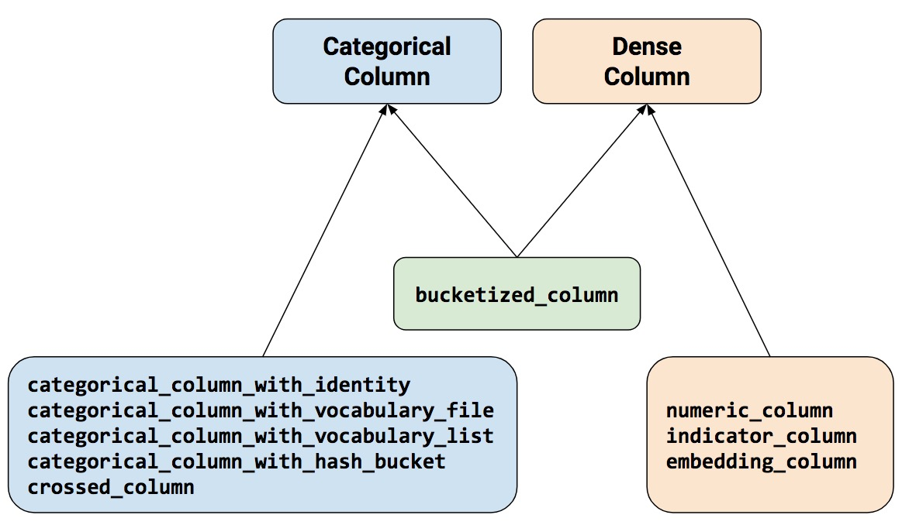

# 5-2 feature_column

Feature column is usually applied in the feature engineering for the structured data, while rarely used for the image or text date.


### 1. Introduction about how to use feature column


Feature column is used to converting category features into one-hot encoding, or creating bucketing feature from continuous feature, or generating cross features from multiple features, etc.


Before creating feature column, please call the functions in the module `tf.feature_column`. The nine most frequently used functions in this module are shown in the figure below. All these functions will return a Categorical-Column or a Dense-Column object, but will not return bucketized_column, since the last class is inhereted from the first two classes.

Be careful: all the Categorical-Column class have to be converted into Dense-Column class through `indicator_column` before input to the model.




<!-- #region -->
* `numeric_column`, the most frequently used function.


* `bucketized_column`, generated from numerical column, listing multiple features from a numerical clumn; it is one-hot encoded.


* `categorical_column_with_identity`, one-hot encoded, identical to the case that each bucket is one interger.


* `categorical_column_with_vocabulary_list`, one-hot encoded; the dictionary is specified by the list.


* `categorical_column_with_vocabulary_file`， one-hot encoded; the dictionary is specified by the file.


* `categorical_column_with_hash_bucket`, used in the case with a large interger or a large dictionary.


* `indicator_column`, generated by Categorical-Column; one-hot encoded.


* `embedding_column`, generated by Categorical Column; the embedded vector distributed parameter needs learning/training. The recommended dimension of the embedded vector is the fourth root to the number of categories.


* `crossed_column`, consists of arbitrary category column except for categorical_column_with_hash_bucket
<!-- #endregion -->

### 2. Demonstration of feature column


Here is a complete example that solves Titanic survival problmen using feature column.

```python
import datetime
import numpy as np
import pandas as pd
from matplotlib import pyplot as plt
import tensorflow as tf
from tensorflow.keras import layers,models


# Printing log
def printlog(info):
    nowtime = datetime.datetime.now().strftime('%Y-%m-%d %H:%M:%S')
    print("\n"+"=========="*8 + "%s"%nowtime)
    print(info+'...\n\n')


    
```

```python
#================================================================================
# 1. Constructing data pipeline
#================================================================================
printlog("step1: prepare dataset...")


dftrain_raw = pd.read_csv("../data/titanic/train.csv")
dftest_raw = pd.read_csv("../data/titanic/test.csv")

dfraw = pd.concat([dftrain_raw,dftest_raw])

def prepare_dfdata(dfraw):
    dfdata = dfraw.copy()
    dfdata.columns = [x.lower() for x in dfdata.columns]
    dfdata = dfdata.rename(columns={'survived':'label'})
    dfdata = dfdata.drop(['passengerid','name'],axis = 1)
    for col,dtype in dict(dfdata.dtypes).items():
        # See if there are missing values.
        if dfdata[col].hasnans:
            # Adding signs to the missing columns
            dfdata[col + '_nan'] = pd.isna(dfdata[col]).astype('int32')
            # Fill
            if dtype not in [np.object,np.str,np.unicode]:
                dfdata[col].fillna(dfdata[col].mean(),inplace = True)
            else:
                dfdata[col].fillna('',inplace = True)
    return(dfdata)

dfdata = prepare_dfdata(dfraw)
dftrain = dfdata.iloc[0:len(dftrain_raw),:]
dftest = dfdata.iloc[len(dftrain_raw):,:]


# Importing data from dataframe
def df_to_dataset(df, shuffle=True, batch_size=32):
    dfdata = df.copy()
    if 'label' not in dfdata.columns:
        ds = tf.data.Dataset.from_tensor_slices(dfdata.to_dict(orient = 'list'))
    else: 
        labels = dfdata.pop('label')
        ds = tf.data.Dataset.from_tensor_slices((dfdata.to_dict(orient = 'list'), labels))  
    if shuffle:
        ds = ds.shuffle(buffer_size=len(dfdata))
    ds = ds.batch(batch_size)
    return ds

ds_train = df_to_dataset(dftrain)
ds_test = df_to_dataset(dftest)
```

```python
#================================================================================
# 2. Defining the feature column
#================================================================================
printlog("step2: make feature columns...")

feature_columns = []

# Numerical column
for col in ['age','fare','parch','sibsp'] + [
    c for c in dfdata.columns if c.endswith('_nan')]:
    feature_columns.append(tf.feature_column.numeric_column(col))

# Bucketized column
age = tf.feature_column.numeric_column('age')
age_buckets = tf.feature_column.bucketized_column(age, 
             boundaries=[18, 25, 30, 35, 40, 45, 50, 55, 60, 65])
feature_columns.append(age_buckets)

# Category column
# NOTE: all the Categorical-Column class have to be converted into Dense-Column class through `indicator_column` before input to the model.
sex = tf.feature_column.indicator_column(
      tf.feature_column.categorical_column_with_vocabulary_list(
      key='sex',vocabulary_list=["male", "female"]))
feature_columns.append(sex)

pclass = tf.feature_column.indicator_column(
      tf.feature_column.categorical_column_with_vocabulary_list(
      key='pclass',vocabulary_list=[1,2,3]))
feature_columns.append(pclass)

ticket = tf.feature_column.indicator_column(
     tf.feature_column.categorical_column_with_hash_bucket('ticket',3))
feature_columns.append(ticket)

embarked = tf.feature_column.indicator_column(
      tf.feature_column.categorical_column_with_vocabulary_list(
      key='embarked',vocabulary_list=['S','C','B']))
feature_columns.append(embarked)

# Embedding column
cabin = tf.feature_column.embedding_column(
    tf.feature_column.categorical_column_with_hash_bucket('cabin',32),2)
feature_columns.append(cabin)

# Crossed column
pclass_cate = tf.feature_column.categorical_column_with_vocabulary_list(
          key='pclass',vocabulary_list=[1,2,3])

crossed_feature = tf.feature_column.indicator_column(
    tf.feature_column.crossed_column([age_buckets, pclass_cate],hash_bucket_size=15))

feature_columns.append(crossed_feature)

```

```python
#================================================================================
# 3. Defining the model
#================================================================================
printlog("step3: define model...")

tf.keras.backend.clear_session()
model = tf.keras.Sequential([
  layers.DenseFeatures(feature_columns), # Placing the feature into tf.keras.layers.DenseFeatures
  layers.Dense(64, activation='relu'),
  layers.Dense(64, activation='relu'),
  layers.Dense(1, activation='sigmoid')
])

```

```python
#================================================================================
# 4. Training the model
#================================================================================
printlog("step4: train model...")

model.compile(optimizer='adam',
              loss='binary_crossentropy',
              metrics=['accuracy'])

history = model.fit(ds_train,
          validation_data=ds_test,
          epochs=10)
```

```python
#================================================================================
# 5. Evaluating the model
#================================================================================
printlog("step5: eval model...")

model.summary()


%matplotlib inline
%config InlineBackend.figure_format = 'svg'

import matplotlib.pyplot as plt

def plot_metric(history, metric):
    train_metrics = history.history[metric]
    val_metrics = history.history['val_'+metric]
    epochs = range(1, len(train_metrics) + 1)
    plt.plot(epochs, train_metrics, 'bo--')
    plt.plot(epochs, val_metrics, 'ro-')
    plt.title('Training and validation '+ metric)
    plt.xlabel("Epochs")
    plt.ylabel(metric)
    plt.legend(["train_"+metric, 'val_'+metric])
    plt.show()

plot_metric(history,"accuracy")
```

```
Model: "sequential"
_________________________________________________________________
Layer (type)                 Output Shape              Param #   
=================================================================
dense_features (DenseFeature multiple                  64        
_________________________________________________________________
dense (Dense)                multiple                  3008      
_________________________________________________________________
dense_1 (Dense)              multiple                  4160      
_________________________________________________________________
dense_2 (Dense)              multiple                  65        
=================================================================
Total params: 7,297
Trainable params: 7,297
Non-trainable params: 0
_________________________________________________________________
```


```python

```

Please leave comments in the WeChat official account "Python与算法之美" (Elegance of Python and Algorithms) if you want to communicate with the author about the content. The author will try best to reply given the limited time available.

You are also welcomed to join the group chat with the other readers through replying **加群 (join group)** in the WeChat official account.


